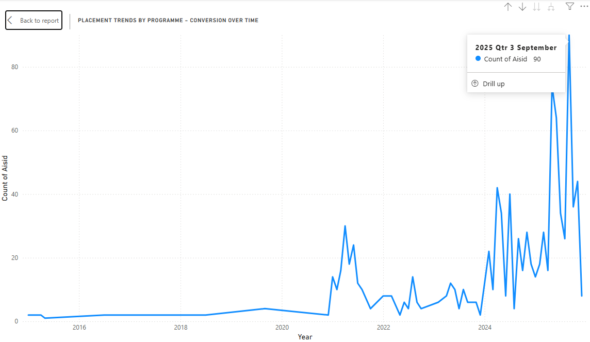
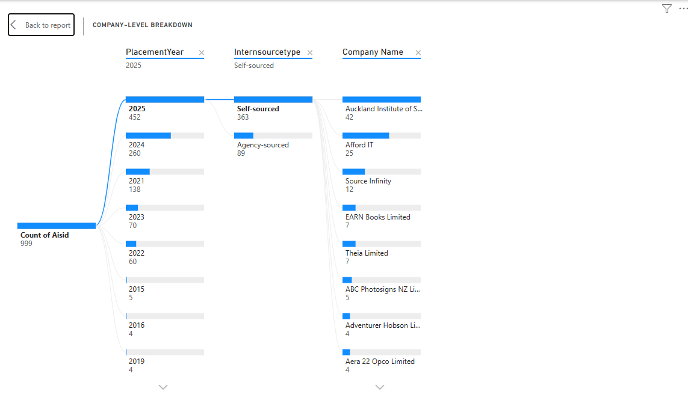

# Internship Placement Analytics Dashboard (Synthetic Data)

A Power BI dashboard built using a synthetic dataset to explore internship placement trends, sourcing patterns, programme performance, and company engagement. Inspired by my real‑world experience working with internship operations, this project demonstrates how data storytelling can support decision‑making.

## Repository Structure
/images                → Dashboard screenshots  
Internship Dashboard.pbix  
synthetic_internship_data.xlsx  
README.md  

## Visualisations
#### **Placement count by year - Understanding Growth and Demand**
The first visualisation looks at placement volume across years and programmes. Even with synthetic data, the pattern mirrors what we often see in real operations: some programmes grow rapidly, others remain steady, and certain years experience sharp increases due to policy changes, industry demand, or student intake.

This view helps answer questions like:
- Which programmes need more employer partnerships?
- Are we prepared for peak placement years?
- How do placement trends align with enrolment cycles?

#### **Intern source type over time - Agency vs Self‑Sourced**
This chart tells a story about student behaviour and market conditions. A rise in self‑sourced internships often signals stronger student confidence, better networking, or improved employability skills. A rise in agency‑sourced roles may indicate the need for more structured support.

Visualising this helps teams:
- Identify where students need more guidance
- Strengthen relationships with agencies
- Balance internal vs external sourcing strategies

#### **Placement trends - Conversion Over Time**
This line chart captures how placement conversion changes year by year. Even in synthetic form, the pattern reflects a common reality: conversion rates can fluctuate based on industry demand, student readiness, and the availability of host companies.

This view supports decisions around:
- Programme‑specific interventions
- Curriculum alignment with industry needs
- Forecasting placement capacity

#### **Company-level breakdown - Where Interns Actually Go**
The hierarchical visualisation breaks down placements by year, source type, and company. It highlights concentration points — which companies host the most interns, and which rely heavily on self‑sourced vs agency‑sourced candidates.

This helps answer:
- Which companies are our strongest partners?
- Where should we focus relationship‑building?
- Are students gravitating toward certain industries?

## How I Built This
- Generated a synthetic dataset to mirror real internship placement structures
- Cleaned and modelled the data in Power BI
- Designed visuals to highlight trends in placement volume, sourcing behaviour, programme performance, and company engagement
- Focused on storytelling and decision-support insights

## Skills Demonstrated
- Data modelling
- Power BI dashboard design
- DAX
- Data cleaning
- Visual storytelling
- Insight communication

## Tools Used
Power BI, Excel/CSV

## Purpose
Working in internship coordination has shown me how powerful data can be when it’s visualised clearly. It transforms operational complexity into actionable insights. This project helped me strengthen my skills in:
- Data cleaning
- Data modelling
- Visual storytelling
- Dashboard design
- Insight communication

## Future Improvements
- Add DAX measures for deeper analysis  
- Include a Python script for data generation  
- Add drill-through pages for company-level insights  

